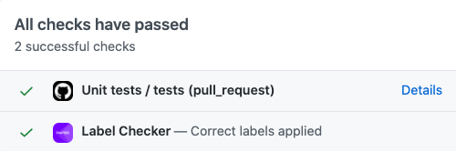
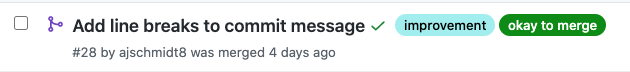
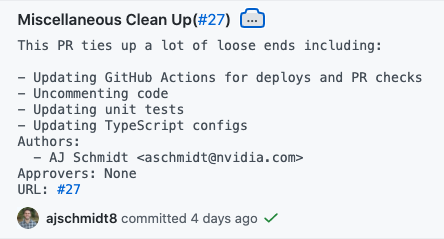

# Ops-bot Playground

## Overview

Branches `branch-0.17` and `branch-0.18` of this repo were created for PICs to test out the new merging and changelog automation that Ops is working on. Feel free to open up and merge PRs to either of these branches (just don't target the `main` branch). You can add new files or make changes to [dummy.md](dummy.md).

Here are some things you can explore:

- The label checker on PRs. This ensures that PRs have one (and only one) of the following labels: `bug`, `doc`, `feature request`, `improvement`. For now adding labels will be a manual process, but this can be automated in a future iteration.

- The _release draft notes_ (available under [ops-bot releases](https://github.com/rapidsai/ops-bot/releases)). Anytime a PR is merged to versioned branch (i.e. `branch-0.xx`), it will be added to that branch's release draft notes. These notes will then be committed to the repo on release day.

- The `okay to merge` label. The auto-merger is cron-based and runs every 30 minutes (on the hour and half past). Adding this label to a PR will schedule it to be merged during the next cycle as long as the following criteria are met:
  - No merge conflicts
  - All GitHub checks are passing (required reviewers, gpuCI, etc.)
  - Not merging into the `main` branch (`main` targeted PRs will be handled manually)
  - User who last added the `okay to merge` label is a part of the `<repo>-write` team (`cudf-write`, `cuml-write`, etc.). All PICs have been added to `ops-bot-write` for the sake of testing this repo.

- Commit messages for auto-merged PRs. They include the PR body, authors, approvers, and a URL to the PR. Note that on GitHub.com, the PR URL appears as `#27`, but in your local `git` log, it will appear as an _actual_ URL. GitHub has some client-side JavaScript that makes it appear that way on their site.

## Feedback

Open an issue or ping #swrapids-ops or @AJ Schmidt in Slack with any questions, problems, or suggestions.
