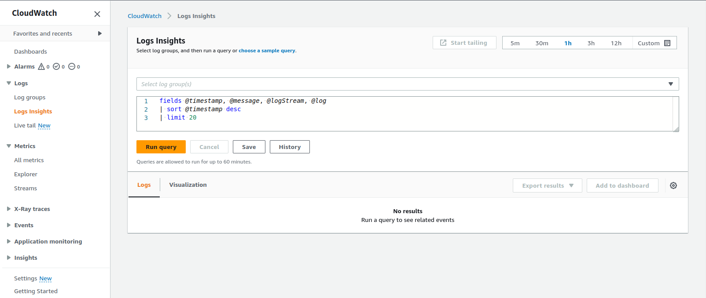
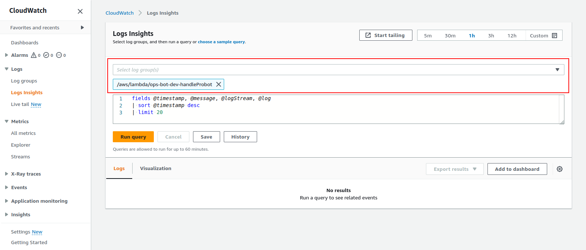
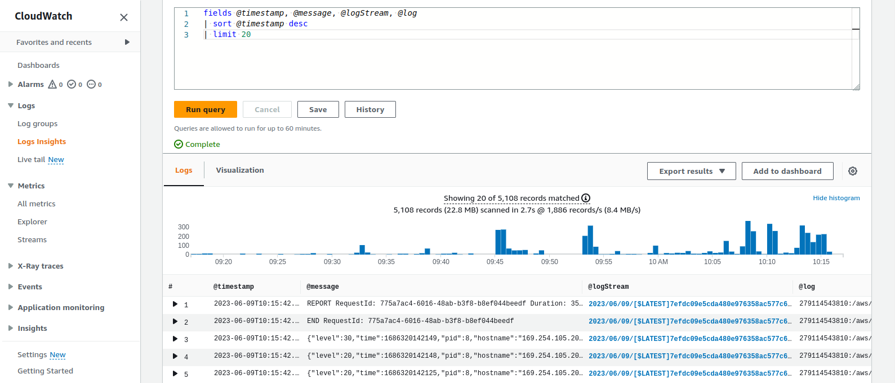

# Troubleshooting

## Introduction

This document outlines how to troubleshoot the `ops-bot` Probot application using AWS's [CloudWatch](https://aws.amazon.com/cloudwatch/) logs.

As noted in the [serverless.yaml](./serverless.yaml) file under the `logRetentionInDays` key, the logs are kept for 60 days.

1. Navigate to the CloudWatch Logs Insights page. The page will look like this:



2. Ensure the correct log group, `/aws/lambda/ops-bot-dev-handleProbot`, is selected:



3. You can now edit and run the log query to see results. Results can be expanded to see additional details. The `@logstream` column link can be used to navigate to the full CloudWatch log for a particular result.



## Useful Queries

Some helpful queries can be found below.

### Searching for plugin messages

Every `ops-bot` plugin has a `plugin` field available in its log messages.

The value of the field can be found in the `super()` call of each plugin's construction function (e.g. [here](https://github.com/rapidsai/ops-bot/blob/7c23688ded5b84e018ce82e49cb9ef2c5fc025af/src/plugins/AutoMerger/auto_merger.ts#L34)).

This field is included in logs that are produced by `this.logger` calls (e.g. [1](https://github.com/rapidsai/ops-bot/blob/7c23688ded5b84e018ce82e49cb9ef2c5fc025af/src/plugins/AutoMerger/auto_merger.ts#L60), [2](https://github.com/rapidsai/ops-bot/blob/7c23688ded5b84e018ce82e49cb9ef2c5fc025af/src/plugins/AutoMerger/auto_merger.ts#L73), [3](https://github.com/rapidsai/ops-bot/blob/7c23688ded5b84e018ce82e49cb9ef2c5fc025af/src/plugins/AutoMerger/auto_merger.ts#L81)).

To query the last 20 log messages for a particular plugin (e.g. the `auto_merger`), you can use this query:

```
fields @timestamp, @message, @logStream
| sort @timestamp desc
| limit 20
| filter plugin like "auto_merger"
```

### Searching for specific plugin messages

To search for a _specific_ plugin message (like [this](https://github.com/rapidsai/ops-bot/blob/7c23688ded5b84e018ce82e49cb9ef2c5fc025af/src/plugins/AutoMerger/auto_merger.ts#L73) `no merge comment on PR` message), can you use a query like this:

```
fields @timestamp, @message, @logStream
| sort @timestamp desc
| limit 20
| filter msg like "no merge comment on PR"
```

### Searching for `auto_merger` plugin logs for a particular PR

Sometimes the `auto_merger` plugin doesn't work and we need to figure out why.

The queries above can be expanded to filter messages for a particular pull request (e.g. `cudf` PR number `13523`):

```
fields @timestamp, @message, @logStream
| sort @timestamp desc
| limit 20
| filter plugin like "auto_merger"
| filter payload.repository.name like "cudf"
| filter payload.issue.number like "13523"
```

## Additional Information

### Structured Logs

The logs for this application are queryable because the Probot application is configured to output structured JSON logs in production.

This is evident by the environment variables below that are listed in the [serverless.yaml](./serverless.yaml) file:

```yaml
NODE_ENV: production
LOG_FORMAT: json
LOG_LEVEL: debug
```

View the Probot documentation here for more details: [https://probot.github.io/docs/logging/](https://probot.github.io/docs/logging/)

### CloudWatch Log Query Documentation

Additional information about the CloudWatch Log query syntax can be found in the AWS official documentation page here: [https://docs.aws.amazon.com/AmazonCloudWatch/latest/logs/CWL_QuerySyntax.html](https://docs.aws.amazon.com/AmazonCloudWatch/latest/logs/CWL_QuerySyntax.html).
